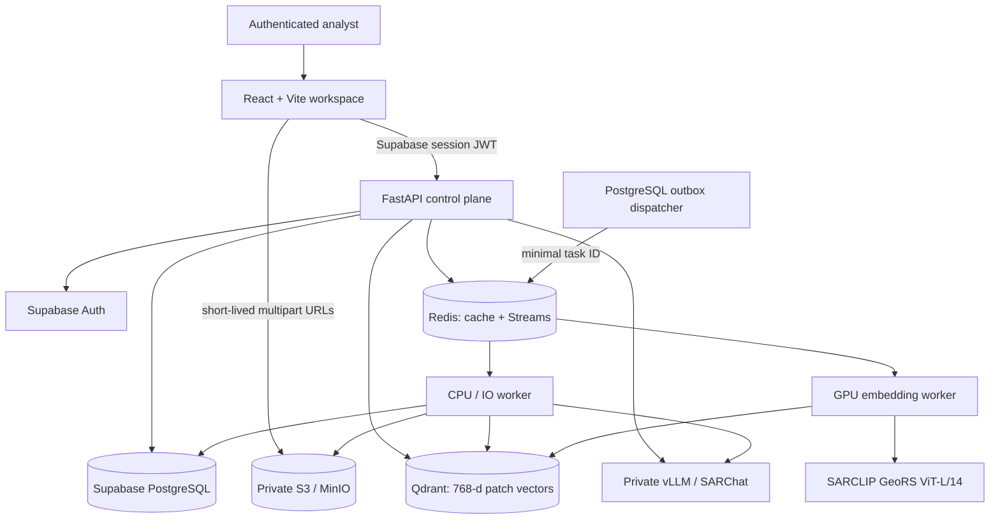

# Raikou — Private, Evidence-Grounded SAR Analysis

Raikou is a private Synthetic Aperture Radar (SAR) analysis workspace. It lets an authenticated analyst create a project, upload a SAR scene, process it into durable visual evidence, search scene patches, and ask questions in a cited chat interface.

The product is deliberately designed around a simple rule:

> SAR imagery shows radar scattering behaviour, not a normal photograph. Raikou must distinguish what is measured, what a validated detector found, and what a model merely observes.

Raikou is therefore **not** an arbitrary-object recognizer. It does not treat a visually similar SARCLIP patch or a model caption as proof that a ship, bridge, building, vegetation, or activity is present. Its intended value is clean, inspectable SAR evidence: scene context, verified detector facts when a validated detector has supplied them, and explicitly uncertain visual observations.

## Contents

- [Product scope and trust model](#product-scope-and-trust-model)
- [Architecture](#architecture)
- [End-to-end scene lifecycle](#end-to-end-scene-lifecycle)
- [SAR processing and visual artifacts](#sar-processing-and-visual-artifacts)
- [Models](#models)
- [RAG and grounded chat](#rag-and-grounded-chat)
- [Detector sidecars and scene records](#detector-sidecars-and-scene-records)
- [Backend and data model](#backend-and-data-model)
- [API reference](#api-reference)
- [Frontend](#frontend)
- [Security, privacy, and safety](#security-privacy-and-safety)
- [Configuration](#configuration)
- [Local development](#local-development)
- [Deployment and operations](#deployment-and-operations)
- [Testing and verification](#testing-and-verification)
- [Repository layout](#repository-layout)
- [Known limitations and roadmap boundaries](#known-limitations-and-roadmap-boundaries)

## Product scope and trust model

### What Raikou does

- Creates user-owned projects and scenes through Supabase Auth-backed APIs.
- Accepts one Sentinel-1 GRD SAFE `.zip`, or one/two GeoTIFF (`.tif`/`.tiff`) sources, optionally with one JSON sidecar.
- Uploads source files directly from the browser to private S3-compatible storage with short-lived multipart URLs; raster bytes do not traverse FastAPI.
- Builds a VRT, display overview, 224×224 SAR patches, patch previews, SARCLIP embeddings, and a durable scene-evidence record.
- Stores 768-dimensional patch embeddings in a tenant/project/scene-filtered Qdrant collection.
- Shows a project workspace containing overviews, scene metadata, processing state, evidence cards, patch details, and chat citations.
- Streams project- or scene-scoped chat over NDJSON and persists the completed conversation history.
- Accepts an optional, validated detector-result sidecar and keeps its provenance separate from model observations.

### What Raikou does not claim

- It does not identify arbitrary objects from a single SAR acquisition.
- SARCLIP is **not** a detector, counter, coordinate authority, or land-cover classifier.
- SARChat is **not** a detector. Its visual output is an observation and is labelled as such.
- The built-in scene context is currently a conservative low-backscatter land/water heuristic, not calibrated segmentation for vegetation, forest, urban areas, agriculture, flood, snow, or ice.
- A detector sidecar is optional. Until a validated detector supplies a class, Raikou cannot honestly count or confirm that class.
- One acquisition does not establish activity, intent, vessel type, fishing, loitering, military activity, temporal change, or a true anomaly.
- Change detection, time-series analysis, live feeds, optical imagery, tasking, public APIs, collaborative organizations, billing, and automated external actions are outside V1.

### Evidence classes

Every answer and workspace card should make its evidence class clear.

| Evidence class | Source | What it can support | What it cannot support |
| --- | --- | --- | --- |
| Acquisition metadata | Source raster/archive and durable scene row | Sensor, acquisition time, polarization, CRS, raster geometry | Semantic scene claims |
| Scene context | Conservative processing heuristic | Water-dominant, land-dominant, or mixed/indeterminate context | Vegetation or a calibrated land-cover class |
| Validated detector evidence | Approved detector JSON sidecar | The detector's class, count, confidence, bounds, crop, and location | Proof that all objects were found; claims outside its trained taxonomy |
| Model observation | SARChat caption/narration | Uncertain descriptions of visible SAR returns and geometry | Verified objects, object counts, new coordinates, activity, intent, or land-cover classes |
| SARCLIP retrieval | Qdrant similarity search over authorized patches | Supporting patch, similar visual evidence, location-oriented inspection | Object detection, counts, absence, or semantic certainty |

## Architecture



### Responsibility boundaries

| Component | Responsibility |
| --- | --- |
| React client | Auth state, project/workspace UX, direct multipart upload, progress polling, search cards, NDJSON chat rendering, short-lived preview display |
| FastAPI | Authentication/ownership checks, API contracts, upload plans, signed URLs, workspace assembly, scoped retrieval, cache coordination, chat orchestration, metrics/readiness |
| Supabase Auth + PostgreSQL | User identity and durable source of truth for projects, scenes, jobs, artifacts, patches, evidence records, conversations, and messages |
| Private S3 or MinIO | Original uploaded files and derived artifacts; the browser receives narrow, expiring URLs rather than storage credentials |
| Redis | Disposable, tenant-scoped RAG cache and Redis Streams transport for worker wake-ups; never the product database |
| PostgreSQL outbox | Authoritative task lifecycle; a Redis outage cannot silently lose a processing job |
| CPU worker | Archive/raster validation, VRT/overview creation, patch/artifact persistence, Qdrant indexing, scene record, caption enrichment, cleanup |
| GPU worker | SARCLIP patch embedding; one worker process per physical GPU is the safe initial topology |
| Qdrant | Cosine similarity retrieval of SARCLIP patch vectors, always filtered by owner/project and optionally scene |
| vLLM / SARChat | Overview captioning and constrained, evidence-grounded scene narration through an OpenAI-compatible local API |

## End-to-end scene lifecycle

### 1. Project and scene creation

The browser creates a project and an owned scene. A scene has a name, free-form metadata, lifecycle status, extracted sensor/acquisition/polarization metadata, source-artifact reference, and timestamps.

```text
draft → uploading → uploaded → queued → processing → ready
                         │                     │
                         └─────────────────────┴→ failed / cancelled

ready → reprocess → queued
ready / failed / cancelled → deleting → deleted
```

The authoritative lifecycle is PostgreSQL. Frontend state is disposable and is reconstructed from authenticated APIs after a page reload.

### 2. Direct-to-object-storage upload

The upload control plane deliberately handles metadata, not raster bytes:

1. The browser calls `POST /api/v1/uploads/initiate` with a generated `client_request_id`, project ID, scene ID, and up to three file descriptors.
2. FastAPI validates ownership, allowed filenames/types, declared sizes, and creates one expiring database-backed upload plan atomically.
3. For each multipart chunk, the browser asks `POST /api/v1/uploads/{plan_id}/parts/sign` for a short-lived S3/MinIO URL and uploads the chunk directly.
4. The browser calls `POST /api/v1/uploads/{plan_id}/complete` with completed parts. The API verifies object metadata and checksums, validates the uploaded content, persists source artifacts, queues the processing job, and writes the durable outbox entry in one atomic workflow.
5. A dispatcher eventually emits the minimal task ID to Redis Streams. Workers must lease and settle the PostgreSQL task before acknowledging the Redis message.

Upload recovery is intentional. Repeating the exact initiation request returns the same active plan; a mismatched replay is rejected. The browser can query plan status or resolve a plan by `client_request_id` after reload/network loss. An unfinished plan can be revoked; a request already in completion is reconciled through durable plan/job state rather than blindly deleting source data.

### 3. Durable processing stages

The M3 worker pipeline is idempotent by scene and stage. Each stage re-materializes its inputs from private object storage, so worker scratch storage is disposable.

| Order | Stage | Execution class | Main output |
| --- | --- | --- | --- |
| 1 | `validate_upload` | CPU | Safe, supported source material |
| 2 | `extract_metadata` | CPU | Raster/SAR metadata |
| 3 | `build_vrt` | CPU | Readable raster VRT |
| 4 | `build_overview` | CPU | Full-scene overview image artifact |
| 5 | `tile_patches` | CPU | Patch rows and bounded preview artifacts |
| 6 | `embed_patches` | GPU | SARCLIP embedding manifest |
| 7 | `index_vectors` | CPU | Scoped Qdrant points and ready patch rows |
| 8 | `build_evidence` | CPU | Scene record, detector validation, optional model caption |
| 9 | `finalize` | CPU | Scene reaches `ready` after durable-artifact/vector checks |
| — | `cleanup` | CPU | Vectors and derived/source state removed according to deletion scope |

The default stream names are separated from cache keys:

```text
raikou:v1:stream:processing:cpu
raikou:v1:stream:processing:gpu
```

## SAR processing and visual artifacts

### Input validation

Supported shapes are:

- One Sentinel-1 GRD SAFE `.zip`, optionally paired with one JSON sidecar; or
- One or two GeoTIFF (`.tif`/`.tiff`) files, optionally paired with one JSON sidecar.

The backend repeats browser-side checks. It validates filenames/MIME declarations, magic bytes, object sizes and checksums; rejects archive traversal, unsafe links, encrypted archives, excessive ZIP entries, high compression ratios, oversized central directories, and Sentinel archives without an expected SAFE manifest. Default limits are configured in `.env.example`, including 20 GiB archive/total upload limits, a 10 GiB raster limit, 20,000 ZIP entries, 80 GiB uncompressed archive bound, and compression ratio bound of 100.

### Patch preprocessing

`backend/app/services/processing/patch_pipeline.py` establishes the visual representation shared by embedding, preview, supporting crops, and model inspection.

| Parameter | Current value | Meaning |
| --- | ---: | --- |
| Patch size | 224 px | Direct ViT-L/14-sized patch cut; no incomplete edge padding |
| Stride | 112 px | 50% overlap between candidate patches |
| No-data discard threshold | >40% zeros | Patch is dropped before embedding |
| SAR dB transform | `10 * log10(value + 1)` | Applied for one/two-band power-like SAR inputs |
| dB clip range | -25 dB to +5 dB | Linearly scaled to 8-bit display channels |
| Overview target | 1024×1024 px | Decimated broad-scene display image |
| Overview split threshold | 8192 px | Larger scenes can produce NW/NE/SW/SE overview sections |

Band handling is explicit:

- **One band:** dB-normalize that band and replicate it into three display channels.
- **Two bands:** form a three-channel representation of VV, VH, and VV−VH in dB space, then normalize each channel.
- **Three or more bands:** treat the first three as already display-encoded RGB-like input and preserve them as 8-bit channels; this prevents generic RGB(A) TIFFs from being incorrectly converted as linear SAR power.

Patch planning discards incomplete edges rather than padding them. The planned count is therefore an estimate; no-data filtering may reduce the actual number of embeddings.

### Derived artifacts

The durable artifact layer can retain source archives/rasters plus derived `overview`, `thumbnail`, `patch_preview`, embedding manifests, `scene_record`, and detector-sidecar evidence artifacts. Artifact rows carry ownership, project/scene association, status, content type, byte size, checksum, storage location, and logical keys. Storage object keys are never returned in normal browser API responses.

Private image previews are granted only on request, only for available overview/thumbnail/patch-preview artifacts, and expire quickly (`ARTIFACT_PREVIEW_TTL_SECONDS`, default 90 seconds). The frontend holds the URL only in component state and opens images with `referrerPolicy="no-referrer"`.

## Models

### SARCLIP GeoRS — retrieval encoder

Raikou uses SARCLIP through OpenCLIP as a **dual encoder** for patch/text similarity:

| Property | Runtime behaviour |
| --- | --- |
| Architecture | OpenCLIP `ViT-L-14` |
| Configured checkpoint | `SARCLIP-GeoRS-ViT-L-14.pt` |
| Other repository checkpoint | `SARCLIP-GeoRS-ViT-B-32.pt` is present but is not the configured V1 retrieval encoder |
| Device | CUDA when available unless `SARCLIP_DEVICE` is explicitly set; CPU fallback is supported for development |
| Batch size | `SARCLIP_BATCH_SIZE`, default 8 in backend settings (compose/example deployment may override it) |
| Vector shape | 768 floating-point values |
| Normalization | Image and text vectors are L2-normalized before cosine search |
| Index | One unnamed 768-dimensional cosine vector per patch in Qdrant |

SARCLIP loads once per worker process through a singleton. It encodes text queries and preprocessed patches into the same embedding space. It is useful for questions such as “show a visually similar patch”, “find the bright elongated return”, or “where is a likely linear structure?”, but **not** for establishing object classes, object counts, land cover, or absence.

### SARChat / visual-language narration

The active application defaults to:

```dotenv
SARCHAT_MODEL_ID=/models/SARChat-InternVL2.5-2B
VLLM_BASE_URL=http://localhost:8001/v1
```

The local model directory is `models/SARChat-InternVL2.5-2B`. It is served by vLLM's OpenAI-compatible chat-completions API and is used in two carefully constrained places:

1. A short, non-authoritative overview caption produced during `build_evidence` when the model service is available.
2. The final evidence-bound narration in M5 chat, supplied with authorized scene context and selected images.

The caption is saved as a `model_generated_caption`/model observation. It is never merged into the detector object list. A caption failure does not make a valid scene fail processing.

The repository also has `launch_vllm.sh`, which references a Phi-based SARChat model. That script is an alternate launch path, not the default application/service configuration. Select exactly one compatible model path and keep `SARCHAT_MODEL_ID`, the vLLM command, model files, prompt image limit, and model license aligned before deployment.

### SARCap / SARCoCa status

Raikou does **not** currently load or invoke a separate SARCap/SARCoCa captioning model. The repository contains a `SARVLM/SARCoCa.pt` placeholder with zero bytes, so it is not a usable runtime checkpoint. Do not describe SARCoCa as a deployed model until an actual checkpoint, loader, preprocessing path, licensing record, and evaluation have been added.

### Detector models

There is no built-in object detector in V1. Raikou accepts a strict detector-result sidecar from an independently selected/trained/validated detector. This keeps the chat layer honest while allowing future ship, aircraft, vehicle, bridge, port, or tank models to plug in without asking SARChat to invent detections.

Before a class is exposed as “verified,” the detector must be evaluated and calibrated for its intended sensor, polarization, resolution, geography, and class taxonomy. A missing detection is never treated as proof of absence.

### Model licensing and operations

Model files are server-side assets and must not be exposed through the frontend. The checked-in SARChat model card identifies a `CC-BY-NC-4.0` license; confirm the upstream license/terms for every checkpoint and its dependencies before any commercial or redistributed deployment. Record model name, version, source, hash, preprocessing, and evaluation results for production detector integrations.

## RAG and grounded chat

### Why this is not naive RAG

Naive RAG embeds the question, retrieves the nearest patch, and asks a language model to answer. For SAR, that produces exactly the failure Raikou is designed to avoid: a patch visually similar to a bridge being presented as evidence for vegetation, buildings, or a count.

Raikou's M5 chat is **scene-record first**. It routes a question according to the evidence needed to answer it before optional vector retrieval:

| Question intent | Example | Primary authority | Is Qdrant retrieval required? |
| --- | --- | --- | --- |
| Environmental context | “Is there vegetation?” | Calibrated segmentation if available; otherwise a limitation plus labelled land/water heuristic | No |
| Detector presence/count | “Are there ships?” / “How many bridges?” | Validated detector facts in the scene record | No |
| Detector location | “Where is the bridge?” | Detector record for class/location; patch can support inspection | Optional |
| Scene description | “Describe the scene” / “What is happening?” | Scene record, metadata, overview, deliberate quadrants, representative evidence | No semantic patch search required |
| Visual evidence | “Show a patch like this” / “Find a bright elongated return” | Authorized SARCLIP patches | Yes |

For a scene-scoped conversation, the service loads the durable scene record before it considers a text-to-patch search. Project-scoped chat has no single canonical scene record, so scoped retrieval can first select candidate scenes.

### RAG context assembled for a scene description

When available, the model receives a bounded projection of:

- Scene name, sensor, acquisition time, and polarizations.
- Conservative land/water context and its explicit limitation.
- Detector status/provenance, detector-backed objects, and coarse spatial groups.
- Non-verified model observation/caption, labelled as such.
- The full overview image.
- Deliberately derived north-west, north-east, south-west, and south-east crops from the already-authorized overview.
- Optional retrieved patch previews and their bounds/similarity scores.
- Relevant acquisition metadata and a bounded conversation history.

The system prompt requires the narrator to separate **Scene context**, **Detector-backed objects**, and **Uncertain observations**. It prohibits converting a bright return, caption, visual impression, or SARCLIP hit into a verified object, count, bounding box, land-cover class, activity, intent, temporal change, vessel type, or anomaly label.

A safe answer may say:

> The scene is water-dominant under a low-backscatter heuristic. The detector record contains no verified object facts. Several bright elongated returns are visible as uncertain observations, but a single acquisition cannot confirm object type or activity.

It must not say that a vessel is fishing, loitering, military, or even a verified ship unless the detector facts explicitly support that statement.

### Retrieval, scope, and citations

`POST /api/v1/search` validates the authenticated owner, project, selected scene, and metadata filters **before** reading cache or querying Qdrant. Qdrant always receives `owner_id` and `project_id`, plus selected/narrowed scene filters. Returned Qdrant point IDs are re-resolved through owned PostgreSQL patch and artifact rows before the client receives an evidence card.

Every chat stream emits NDJSON events. Important event types include:

- `conversation` — conversation and scope IDs.
- `status` — preparation/retrieval/generation status.
- `citations` — explicit source list, including an empty list for safe failures.
- `text` — incremental assistant text.
- `error` — a bounded generation failure message when needed.
- `done` — terminal status and persisted assistant message ID.

Each citation carries source type/ID, scene, optional artifact/patch IDs, patch bounds, retrieval score where applicable, reason supplied, and bounded provenance. The UI opens owned patch/overview evidence from those citations rather than exposing a storage path.

### Redis cache contract

Redis is an optimization, never a source of truth. After ownership validation, M5 can cache:

| Cached value | Default TTL |
| --- | ---: |
| Query embedding | 3,600 seconds |
| Qdrant IDs and scores | 300 seconds |
| Bounded authorized RAG-context projection | 120 seconds |

Cache keys contain only the validated owner/project/optional-scene scope, normalized query/filter digest, SARCLIP/SARChat version, Qdrant index version, and a project cache-generation value. They never contain raw bearer tokens, raw query text, prompts, signed URLs, object bytes, database rows, or stream frames. Evidence/lifecycle mutations advance project cache generation and invalidate derived keys.

### Multimodal prompt capacity

The default vLLM compose/systemd service command limits a request to four images, while a rich description can require a full overview plus four quadrants and optional supporting patches. Before relying on all of those images, align `--limit-mm-per-prompt` with the enabled M5 overview/patch/quadrant settings, model VRAM, and vLLM version. Otherwise reduce the RAG image budget deliberately. This is a deployment/configuration contract, not a reason to silently drop or mislabel evidence.

## Detector sidecars and scene records

### Detector sidecar contract

An optional metadata file becomes detector evidence only if it is a JSON object in the approved schema:

```json
{
  "schema_version": "raikou.detector.v1",
  "detector": {
    "name": "example-sar-ship-detector",
    "version": "1.0.0",
    "source_artifact_sha256": "<hex SHA-256 of an uploaded source artifact>",
    "confidence_semantics": "Calibrated probability on held-out validation data"
  },
  "detections": [
    {
      "id": "tile-0042-pred-7",
      "label": "ship",
      "confidence": 0.91,
      "bbox_xyxy": [1024, 512, 1106, 548]
    }
  ]
}
```

The pipeline rejects generic JSON metadata as detector evidence. It requires the exact schema version, non-empty detector name/version, a source checksum that matches an uploaded source artifact, an array of detections, finite in-scene positive-area horizontal boxes, and confidence values in `[0, 1]`.

### Scene record construction

`scene_record.json` is the durable analysis projection used by the workspace and M5. It contains:

- Schema version, scene/session identifier, generation time, raster shape/bands/dtypes/nodata, source metadata, CRS, pixel convention, transform, and geographic bounds.
- A low-backscatter Otsu land/water estimate with water/land fractions, separability, heuristic label, calibration flag, and `review_required` state.
- Detector status/provenance, raw and deduplicated detection counts, validation errors, and class-aware IoU NMS metadata.
- Validated object facts: ID, label, confidence, horizontal scene-pixel bounds, centroid, native/WGS84 coordinate when available, source IDs, supporting-crop path, and clipping state.
- Supporting 224×224 display crop references.
- Explicit limitations, plus an optional model-generated overview caption that is marked non-verified.

Class-aware non-maximum suppression occurs in global scene pixel coordinates after sidecar detections have been validated. Its current IoU threshold is `0.5`. Future detector integration should extend the sidecar and record with detector model hash, preprocessing version, tile IDs, merged detection IDs, calibrated confidence metadata, rotated boxes where justified, and analyst review state (`unreviewed`, `accepted`, `rejected`, `uncertain`). Those fields are product goals, not current V1 guarantees.

## Backend and data model

### Backend stack

| Area | Technology |
| --- | --- |
| API | Python 3.11, FastAPI, Uvicorn, Pydantic v2 |
| Raster processing | Rasterio/GDAL, NumPy, Pillow |
| Retrieval model | PyTorch, Torchvision, OpenCLIP, SARCLIP GeoRS ViT-L/14 |
| VLM service client | OpenAI Python client against private vLLM OpenAI-compatible endpoint |
| Auth/data | Supabase Auth, PostgreSQL, `supabase-py`, Psycopg |
| Object storage | Boto3 over AWS S3 or MinIO-compatible S3 API |
| Cache/work transport | Redis Streams and bounded Redis cache |
| Vector index | Qdrant cosine collection |
| Tests | Pytest |

The exact Python dependencies are pinned as minimum versions in `backend/requirements.txt`. The container image starts from `python:3.11-slim`, installs GDAL/runtime libraries, then installs those requirements.

### PostgreSQL entities

The Supabase migrations are ordered lexically and must all be applied. Major durable entities are:

| Entity | Purpose |
| --- | --- |
| `profiles` | App profile tied to Supabase Auth user |
| `projects` | Single-owner analyst projects |
| `scenes` | Uploaded/processed SAR scene lifecycle and extracted metadata |
| `scene_artifacts` | Private source/derived artifact metadata |
| `processing_jobs` | User-visible scene processing/cleanup job |
| `processing_job_tasks` | Durable M3 stage tasks |
| `processing_task_dispatches` and `processing_job_dispatches` | PostgreSQL transactional outboxes/dispatch state |
| `processing_job_events` | Durable event history for the workspace |
| `patches` | Patch bounds, Qdrant point ID, readiness, model provenance, preview reference |
| `scene_evidence_records` | Current/superseded evidence projection, model observation, detector facts, provenance |
| `upload_plans` and `upload_plan_files` | Recoverable browser multipart upload state |
| `conversations` and `messages` | Owner/project/optional-scene scoped chat history and citations |

Migrations also define lifecycle enums, indexes, ownership/RLS support, updated-at triggers, conversation/message scope synchronization, upload finalization/recovery procedures, task enqueue/cancellation/cleanup procedures, reprocessing procedures, and schema-readiness RPC probes.

### Qdrant payload contract

Each V1 patch vector uses an unnamed 768-dimensional cosine vector and carries tenant scope with its payload:

```text
owner_id, project_id, scene_id,
source_artifact_id,
row_start, row_end, col_start, col_end, patch_size,
model_name, model_version,
sensor, acquisition_date, polarization
```

Qdrant payload indexes include session compatibility plus owner/project/scene/source artifact fields. PostgreSQL remains canonical for authorization and artifact identity; Qdrant is never the only record of a scene.

## API reference

All V1 product routes are under `/api/v1` and require a Supabase bearer token. The OpenAPI document is served at `/api/v1/openapi.json`. Ownership checks precede all project, scene, upload, job, artifact, patch, search, and conversation reads/writes.

### Projects and scenes

| Method | Route | Purpose |
| --- | --- | --- |
| `GET` | `/projects` | List caller-owned projects |
| `POST` | `/projects` | Create project (`name`, optional `description`) |
| `GET` | `/projects/{project_id}` | Get owned project |
| `PATCH` | `/projects/{project_id}` | Update project name/description |
| `DELETE` | `/projects/{project_id}` | Delete eligible project through safe lifecycle rules |
| `GET` | `/projects/{project_id}/scenes` | List owned scenes |
| `POST` | `/projects/{project_id}/scenes` | Create scene (`name`, optional metadata) |
| `GET` | `/scenes/{scene_id}` | Get owned scene |
| `PATCH` | `/scenes/{scene_id}` | Update allowed scene fields |
| `DELETE` | `/scenes/{scene_id}` | Request safe cleanup/deletion |
| `GET` | `/scenes/{scene_id}/artifacts` | List owned artifact metadata, never object keys |

### Uploads and jobs

| Method | Route | Purpose |
| --- | --- | --- |
| `POST` | `/uploads/initiate` | Create/replay idempotent multipart upload plan |
| `GET` | `/uploads/initiation/{client_request_id}` | Recover the plan associated with a browser request ID |
| `GET` | `/uploads/{upload_plan_id}/status` | Read durable upload-plan and linked-job state |
| `POST` | `/uploads/{upload_plan_id}/parts/sign` | Obtain short-lived URL(s) for declared multipart parts |
| `POST` | `/uploads/{upload_plan_id}/complete` | Verify objects and atomically queue processing |
| `DELETE` | `/uploads/{upload_plan_id}` | Abort/revoke unfinished plan |
| `GET` | `/jobs/scenes/{scene_id}` | List jobs for an owned scene |
| `GET` | `/jobs/{job_id}` | Read an owned processing job |
| `GET` | `/jobs/{job_id}/events` | Read durable job event history |
| `POST` | `/jobs/{job_id}/cancel` | Request cancellation |

### Workspace, evidence, and previews

| Method | Route | Purpose |
| --- | --- | --- |
| `GET` | `/projects/{project_id}/workspace` | Batched project state and scene summaries |
| `GET` | `/scenes/{scene_id}/workspace` | Selected scene, artifacts, jobs, patches, overview/evidence availability |
| `GET` | `/scenes/{scene_id}/evidence-record` | Labelled metadata, land/water, model observation, and detector evidence |
| `POST` | `/scenes/{scene_id}/reprocess` | Queue eligible failed/cancelled/ready scene for reprocessing |
| `POST` | `/artifacts/{artifact_id}/preview` | Create a short-lived private image-preview grant |
| `GET` | `/patches/{patch_id}` | Read owned patch bounds/provenance and preview reference |
| `POST` | `/search` | Scoped evidence search with project ID, optional scene ID, query, limit, and metadata filters |

### Conversations and NDJSON chat

| Method | Route | Purpose |
| --- | --- | --- |
| `POST` | `/conversations` | Create an immutable project- or scene-scoped conversation |
| `GET` | `/projects/{project_id}/conversations` | List owned project conversations; optional scene filter |
| `GET` | `/conversations/{conversation_id}/messages` | Load durable owned messages and citations |
| `POST` | `/conversations/{conversation_id}/stream` | Persist user turn and stream evidence-grounded response as `application/x-ndjson` |

### Health and metrics

| Method | Route | Purpose |
| --- | --- | --- |
| `GET` | `/healthz` | Process liveness only |
| `GET` | `/readyz` | Checks configuration, M1–M5 schema readiness, Supabase, object storage, Qdrant, and configured Redis |
| `GET` | `/metrics` | Prometheus text metrics; protect with `X-Metrics-Token` when configured |

### Legacy session API

`/api/v1/ingestion`, `/api/v1/processing`, and `/api/v1/search` are legacy session-oriented prototype routes. They are mounted only when `ENABLE_LEGACY_SESSION_API=true`. They are intentionally disabled in production because a session ID does not provide the durable project/owner isolation required by V1. New frontend work must use the project/scene APIs above.

## Frontend

The frontend is React 18 + Vite + React Router + TanStack Query + Tailwind CSS + Lucide icons. It uses `@supabase/supabase-js` for authentication and a single authenticated FastAPI client for all product data.

Primary workspace surfaces are:

- **Overview** — project/scene state, overview and current evidence availability.
- **Scenes** — scene selection, metadata, status, artifacts, and processing lifecycle.
- **Evidence Search** — scoped SARCLIP patch search with citations/provenance.
- **Ask** — project/scene-scoped conversations, incremental NDJSON text, persistent history, and clickable citations.

The browser does not query product tables directly, never talks to Redis/Qdrant, never receives Supabase service-role credentials, and never retains a signed preview URL as durable state. It sends its current Supabase access token to FastAPI as `Authorization: Bearer <token>`.

For production behind the included gateway, the frontend and API share one origin. In local development, `VITE_API_URL` can point to `http://localhost:8000`; production deliberately ignores a localhost API setting.

## Security, privacy, and safety

### Authorization and storage

- Every product route resolves the current Supabase user, then validates project/scene/conversation/artifact/patch ownership before database, storage, Redis, or Qdrant operations.
- Qdrant has mandatory `owner_id` and `project_id` filters; scene and metadata narrowing are additional filters, not optional UI hints.
- Supabase/PostgreSQL is the source of truth; Qdrant, Redis, browser state, workers, and temporary session directories are not authorization authorities.
- The storage bucket remains private. Browser upload/download access is narrow and short-lived.
- The service-role key, direct worker database URL, storage credentials, Redis URL, and model paths are server-only configuration. Never put them in Vite/React environment variables.

### HTTP hardening

FastAPI applies CORS plus release-hardening/response-header middleware. The included Caddy/Nginx examples set security headers, disable unsafe framing, limit gateway body size to bounded control-plane requests, disable proxy buffering for chat, and serve the SPA fallback. Production CORS must name only real HTTPS frontend origins—never `*` or localhost.

### Evidence safety

- Generated captions are always labelled as model observations.
- Detector facts must originate in the validated sidecar, never model text.
- Environmental questions do not fall through to patch retrieval.
- Detector absence is not proof of object absence.
- Chats cite their supplied evidence and use a safe insufficiency response when evidence is unavailable/weak where retrieval is required.

## Configuration

Copy the repository template to the backend runtime location and populate real values:

```powershell
Copy-Item .env.example backend\.env
```

Do not commit `backend/.env`. `.env.example` is the complete reference; these groups explain the variables that matter operationally.

### Core and identity

| Variables | Purpose |
| --- | --- |
| `ENVIRONMENT` | `development` or `production`; production fails closed on missing critical configuration |
| `PROJECT_NAME`, `API_V1_STR` | API identity and versioned prefix |
| `CORS_ORIGINS`, `CORS_ALLOW_CREDENTIALS` | Exact frontend origins and credential policy |
| `ENABLE_LEGACY_SESSION_API` | Local-only legacy routes; must be `false` in production |
| `SUPABASE_URL`, `SUPABASE_SERVICE_KEY` | Backend Supabase client/auth validation |
| `SUPABASE_DB_URL` | Direct PostgreSQL URL used by dispatcher and workers, not the browser |
| `METRICS_TOKEN`, `LOG_JSON` | Metrics protection and structured logging |

### Storage and upload controls

| Variables | Purpose |
| --- | --- |
| `STORAGE_BACKEND` | `minio` for local S3-compatible development or `s3` for AWS |
| `STORAGE_BUCKET`, `STORAGE_REGION`, `STORAGE_ENDPOINT_URL` | Private bucket and endpoint configuration |
| `STORAGE_FORCE_PATH_STYLE` | Usually `true` for MinIO |
| `STORAGE_ACCESS_KEY_ID`, `STORAGE_SECRET_ACCESS_KEY`, `STORAGE_SESSION_TOKEN` | Optional explicit credentials; prefer an AWS IAM role in production |
| `STORAGE_SIGNED_URL_TTL_SECONDS`, `ARTIFACT_PREVIEW_TTL_SECONDS` | Expiry of upload/download and display grants |
| `UPLOAD_*` | Multipart part size, plan/lease timing, file/archive/ZIP safety limits |
| `JOB_DISPATCH_*` | Outbox publishing lease and bounded retry timing |

### Queue, workers, and vector store

| Variables | Purpose |
| --- | --- |
| `REDIS_URL`, `REDIS_KEY_PREFIX`, Redis socket timeouts | Worker Stream connection and tenant-safe cache namespace |
| `QDRANT_URL`, `QDRANT_API_KEY`, `QDRANT_COLLECTION` | Qdrant connection and collection (`sar_patches` by default) |
| `M3_OUTBOX_POLL_SECONDS`, leases, stream block/claim values | Durable task polling/recovery behaviour |
| `M3_CPU_WORKER_CONCURRENCY` | CPU/IO worker concurrency |
| `M3_GPU_INFERENCE_CONCURRENCY` | Per-GPU process inference concurrency; begin at 1 |
| `M3_TASK_MAX_ATTEMPTS`, `M3_QDRANT_BATCH_SIZE`, `M3_MAX_PATCH_PREVIEWS` | Retry, indexing, and preview limits |

### Models and chat budgets

| Variables | Purpose |
| --- | --- |
| `VLLM_BASE_URL`, `SARCHAT_MODEL_ID` | Private visual-language model endpoint and model path |
| `SARCLIP_CHECKPOINT_PATH`, `SARCLIP_DEVICE`, `SARCLIP_BATCH_SIZE` | Retrieval model loading/inference |
| `SARCLIP_MODEL_NAME`, `SARCLIP_MODEL_VERSION` | Stored patch/Qdrant provenance |
| `M3_VLLM_*` | Worker caption timeout, input-size, image, and token budgets |
| `M5_QUERY_EMBEDDING_TTL_SECONDS`, `M5_RETRIEVAL_TTL_SECONDS`, `M5_RAG_CONTEXT_TTL_SECONDS` | Bounded evidence-cache lifetimes |
| `M5_SEARCH_MAX_RESULTS`, `M5_WEAK_RETRIEVAL_SCORE` | Search limits and weak-result cutoff |
| `M5_MAX_*` | Query/history/context/fact/image/output budgets |
| `M5_SCENE_QUADRANT_SAMPLES`, `M5_SCENE_QUADRANT_MAX_PIXELS` | Description-time transient overview crops |
| `M5_QDRANT_INDEX_VERSION` | Bump when payload/index semantics change to bypass stale derived cache |

## Local development

### Prerequisites

- Docker Desktop/Engine and Docker Compose v2 are the recommended way to obtain GDAL/Rasterio and local Redis/MinIO/Qdrant.
- A Supabase project with the repository migrations applied. The backend needs URL/service key; workers also need a direct PostgreSQL URL.
- Node.js and npm for the standalone Vite development server.
- NVIDIA driver plus NVIDIA Container Toolkit only when using the GPU profile.
- Local model files mounted under `./models`, including the configured SARChat directory and SARCLIP checkpoint path.

### Run the durable stack

1. Create `backend/.env` from `.env.example` and set real Supabase values. For local Compose, retain the MinIO/Redis/Qdrant values supplied by Compose or match them in the file.
2. Apply the Supabase migrations in lexical order from `supabase/migrations/`. Use your approved Supabase migration workflow; do not hand-edit production tables.
3. Start the base services and API/CPU worker:

   ```bash
   docker compose up --build
   ```

4. For GPU embedding and local vLLM, start with the GPU profile:

   ```bash
   docker compose --profile gpu up --build
   ```

5. Check readiness:

   ```bash
   curl http://localhost:8000/healthz
   curl http://localhost:8000/readyz
   ```

The base Compose stack includes Redis with persistence, MinIO, MinIO bucket initialization, Qdrant, FastAPI, outbox dispatcher, and CPU worker. The GPU profile adds vLLM and GPU worker. MinIO's API/console are published at ports `9000`/`9001`; the API is published at `8000`.

### Run the frontend separately

```bash
cd frontend
npm ci
npm run dev
```

Set `VITE_SUPABASE_URL`, `VITE_SUPABASE_ANON_KEY`, and optionally `VITE_API_URL=http://localhost:8000` in the frontend development environment. Never add a Supabase service key, direct database URL, storage secret, Redis URL, or model credential to frontend variables.

### Direct Python development

Docker is preferred because Rasterio/GDAL and CUDA requirements vary by platform. If you use a local Python environment, install `backend/requirements.txt`, ensure GDAL/Rasterio works, set the same server-only environment variables, and run:

```bash
cd backend
python -m uvicorn main:app --reload --host 0.0.0.0 --port 8000
```

Run the dispatcher and workers in separate terminals when testing the durable pipeline:

```bash
python -m app.workers.dispatcher
python -m app.workers.runner --class cpu
python -m app.workers.runner --class gpu
```

## Deployment and operations

Read the detailed [M6 release runbook](docs/m6-release-runbook.md) before a production release. The production sequence is:

1. Assign a real DNS name and TLS gateway configuration.
2. Create a least-privilege AWS IAM role for the private bucket; keep block-public-access enabled. Do not put static AWS credentials in the browser or source tree.
3. Set a mode-`0600` production environment file with Supabase, direct PostgreSQL, Redis, Qdrant, bucket, model, CORS, and metrics configuration.
4. Apply every Supabase migration in lexical order and verify migration history/readiness probes.
5. Put model artifacts on the GPU host and verify checksums/licensing.
6. Build the React frontend and start Compose or equivalent systemd services.
7. Start the dispatcher, CPU worker(s), and exactly one GPU worker for each physical GPU.
8. Validate `/healthz`, `/readyz`, processing, scoped search, and cited chat using a non-sensitive test scene.

### Compose release

The release profile includes Caddy, which serves the built frontend and reverse-proxies API/health routes. Set an actual DNS name before starting it:

```powershell
$env:PUBLIC_HOST = 'raikou.example.com'
docker compose --profile gpu --profile release up -d --build
```

The included Caddy/Nginx examples keep Uvicorn/vLLM behind the gateway, configure no-store/no-referrer-safe behaviour where required, forward streamed chat without buffering, and serve the Vite SPA fallback.

### Systemd topology

Deployment units are included for a systemd host:

```text
sar-backend.service                 FastAPI/Uvicorn control plane
sarchat-vllm.service                private vLLM model server
raikou-outbox-dispatcher.service    PostgreSQL outbox → Redis Streams
raikou-worker-cpu@.service          CPU/IO M3 worker
raikou-worker-gpu@.service          one CUDA-device worker per instance
```

Start GPU instances conservatively, for example `raikou-worker-gpu@0`. Profile SARCLIP VRAM with `backend/scripts/profile_sarclip_vram.py` before raising concurrency. Use `backend/scripts/measure_vllm_tokens.py` to inspect model token/image-budget behaviour.

### Monitoring, backup, and incidents

- Alert on non-ready API state, worker restart loops, Redis Stream lag/pending messages, outbox backlog, retry/failure rates, S3 failures, Qdrant/model errors, and terminated chat streams.
- Correlate API/worker logs with request ID, project, scene, and job identifiers. Do not log bearer tokens, prompt bodies, signed URLs, object bytes, or secrets.
- Enable Supabase backups/PITR and rehearse restores. Enable S3 versioning and lifecycle cleanup of incomplete multipart uploads. Snapshot Qdrant before index changes.
- Roll back application/configuration releases if needed, but never destructively roll back an applied database migration; create a forward repair migration instead.
- For credential exposure, rotate Supabase, DB, storage/IAM, model-service, and metrics credentials; update protected configuration; restart affected services.

## Testing and verification

Run backend tests from an environment with `backend/requirements.txt` installed:

```bash
python -m pytest backend/tests -q
```

The test suite includes scene-chat policy checks, generic TIFF visual-processing behaviour, and release-hardening checks. At minimum, verify:

1. Environment questions route to the limitation/scene-context path, never a retrieved patch as a class claim.
2. Object count/presence questions route to detector facts.
3. Missing detector output produces an explicit limitation, not “no objects exist.”
4. A detector count is derived from the supplied facts and does not use SARCLIP similarity as authority.
5. User A cannot retrieve User B's project, scene, job, patch, artifact, search result, conversation, or preview.
6. Every production dependency passes `/readyz` and all M1–M5 readiness RPCs.
7. A scene deletion cancels active work, removes Qdrant vectors and storage artifacts through durable cleanup, then removes database scope last.
8. Reloading the workspace rebuilds state from the authenticated API, including conversation history/citations.

## Repository layout

```text
Raikou/
├── backend/
│   ├── main.py                         FastAPI app, health/readiness, middleware, router wiring
│   ├── app/api/routes/                 projects, scenes, uploads, jobs, workspace, evidence, legacy routes
│   ├── app/api/deps.py                 Supabase JWT and ownership resolution
│   ├── app/core/                       configuration, observability, release middleware
│   ├── app/schemas/                    typed Pydantic contracts
│   ├── app/services/
│   │   ├── cache/                      Redis keyspace and M5 cache controls
│   │   ├── ingestion/                  SAFE/GeoTIFF metadata and VRT helpers
│   │   ├── models/                     SARCLIP encoder
│   │   ├── processing/                 patches, scene record, RAG policy/router
│   │   ├── storage/                    S3/MinIO adapter, Qdrant, payload contract
│   │   ├── uploads/                    file/object/archive validation
│   │   └── jobs/                       Redis Streams publisher
│   ├── app/workers/                    durable dispatcher, worker runner, stages, repository
│   ├── scripts/                        GPU VRAM and vLLM token measurement helpers
│   ├── tests/                          unit/release-policy tests
│   ├── Dockerfile
│   └── requirements.txt
├── frontend/
│   ├── src/auth/                       Supabase auth provider
│   ├── src/pages/                      landing, login, dashboard, project workspace
│   ├── src/components/                 upload, job, evidence search, grounded chat UI
│   ├── src/services/                   authenticated FastAPI client and multipart upload client
│   └── src/lib/                         Supabase and TanStack Query setup
├── supabase/migrations/                ordered M1–M5 schema migrations
├── deployment/                         Caddy, Nginx, and systemd deployment units
├── docs/                               architecture, M2–M6 operations/runbooks
├── models/                             local SARChat model directory/checkpoints (server-side only)
├── SARVLM/                             SAR model assets and related project material
├── docker-compose.yml                  local/release service topology
├── .env.example                        server-side configuration template
└── README.md                           this guide
```

## Known limitations and roadmap boundaries

The following limitations are intentional and should remain visible in product copy and model prompts until they are genuinely solved:

1. **No calibrated scene segmentation.** The current land/water result is a backscatter heuristic. To answer vegetation/forest/agriculture/urban/flood/ice/snow reliably, add a SAR-compatible segmentation model, provenance, evaluation, calibration, and evidence record—not a prompt change.
2. **No integrated object detector.** Current object claims depend on an approved sidecar. A future detector should use inference tiles sized for expected target pixels, enough overlap for edge objects, global-coordinate remapping, global NMS, calibrated class scores, supporting crops/overlays, model/preprocessing hashes, and analyst review state.
3. **No arbitrary object naming.** SARChat and SARCLIP observations must remain uncertain unless a detector/segmentation product explicitly supports the claim.
4. **No temporal inference.** “Activity,” “change,” and “anomaly” require multi-temporal or external-data workflows; a single scene can only report observable returns, geometry, texture, and distribution.
5. **No production reliance on legacy session routes.** Use the V1 project/scene/evidence API only.
6. **Model/config compatibility is operational work.** The model server image capacity, prompt budgets, CUDA/PyTorch versions, model path, and licenses must be verified together on the target hardware.

For deeper design and release detail, read [the top-down architecture](docs/v1-top-down-architecture.md), [the implementation plan](docs/v1-implementation-plan.md), [M2 upload operations](docs/m2-upload-operations.md), [M3 durable pipeline](docs/m3-durable-pipeline.md), [M4 workspace](docs/m4-workspace.md), [M5 evidence chat](docs/m5-evidence-chat.md), and [the M6 release runbook](docs/m6-release-runbook.md).
