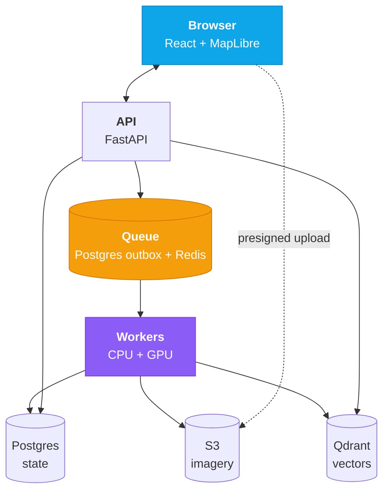
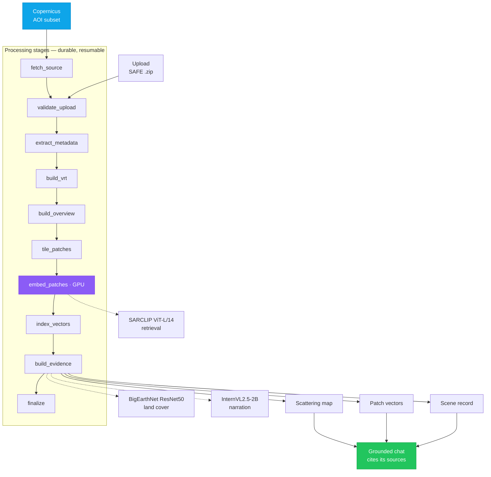

# Raikou

**Teaching AI to read radar.**

Satellite radar sees through cloud and darkness, which is why it matters for floods, shipping and disaster response. But a SAR image is not a photograph — it is a map of how surfaces bounced a microwave back, and a model trained on photographs reads it as noise.

Raikou is a retrieval-augmented pipeline that turns a Sentinel-1 scene into something a language model can answer questions about **without inventing anything**. Every claim traces back to a measurement, a patch, or a calibrated number. Where it cannot support an answer, it says so.

---

## The problem

Ask a general-purpose model about a SAR scene and it will confidently describe ships that are not there. Three reasons, and one response to each:

| Problem | What Raikou does instead |
|---|---|
| Vision models hallucinate on radar | Answers are assembled from measured evidence, not generated from the image |
| Land-cover labels do not travel between regions | Classifies by **scattering mechanism** — surface physics, not ecology |
| A scene is 25,000 px wide | Tiled into patches, embedded, retrieved by similarity |

On the second point: a European-trained land-cover network returns *"Coniferous forest"* on the Andhra coast, because CORINE has no tropical category and the model must pick its nearest label. Scattering mechanism asks a different question — *did this surface reflect, depolarise, or double-bounce?* — and the physics is the same in Finland and in a mangrove.

---

## What it does today

- **Two ways in** — upload a Sentinel-1 SAFE archive, or draw an area on a map and let the server fetch it from Copernicus
- **Area-of-interest fetch** — cuts just the drawn box out of a scene: **3 MB instead of 1.7 GB**, orthorectified, at native 10 m
- **Durable processing** — ten stages, independently resumable, survives restarts and spot interruptions
- **Scattering classification** — surface / double-bounce / volume / rough, fitted per scene and *rejected* when the scene cannot support a fit
- **Patch retrieval** — SARCLIP embeddings in Qdrant, scoped per project
- **Grounded chat** — cites the patch or measurement behind every claim
- **Honest gaps** — no detector has been run, so it will not count ships; it says so rather than guessing

---

## 1. Workflow

What a user actually does.


```mermaid
flowchart LR
    A["Draw an area<br/>on the map"] --> B["Pick a<br/>Sentinel-1 scene"]
    B --> C["Server fetches<br/>and analyses it"]
    C --> D["Ask questions<br/>in plain English"]
    D --> E["Answers with<br/>cited evidence"]

    style A fill:#0ea5e9,color:#fff,stroke:#0284c7
    style E fill:#22c55e,color:#fff,stroke:#16a34a
```

The tab can be closed at any point — processing is a durable background job, not a browser upload.

---

## 2. High-level architecture

Four pieces, each with one job.


```mermaid
flowchart TB
    UI["<b>Browser</b><br/>React + MapLibre"]
    API["<b>API</b><br/>FastAPI"]
    Q[("<b>Queue</b><br/>Postgres outbox + Redis")]
    W["<b>Workers</b><br/>CPU + GPU"]
    DB[("Postgres<br/>state")]
    S3[("S3<br/>imagery")]
    VDB[("Qdrant<br/>vectors")]

    UI <--> API
    API --> Q
    Q --> W
    W --> DB
    W --> S3
    W --> VDB
    API --> DB
    API --> VDB
    UI -.->|"presigned upload"| S3

    style UI fill:#0ea5e9,color:#fff,stroke:#0284c7
    style W fill:#8b5cf6,color:#fff,stroke:#7c3aed
    style Q fill:#f59e0b,color:#fff,stroke:#d97706
```

Two decisions worth calling out. **Scene bytes never pass through the API** — the browser uploads straight to S3 with presigned URLs, and the server enforces a 4 MiB request cap. And **Postgres is the only source of truth**; Redis exists to wake workers, so losing it delays work but never loses it.

---

## 3. Technical system design

The pipeline in detail.


```mermaid
flowchart TB
    U["Upload<br/>SAFE .zip"]
    C["Copernicus<br/>AOI subset"]

    subgraph PIPE["Processing stages — durable, resumable"]
        direction TB
        S1["fetch_source"] --> S2["validate_upload"] --> S3["extract_metadata"]
        S3 --> S4["build_vrt"] --> S5["build_overview"] --> S6["tile_patches"]
        S6 --> S7["embed_patches · GPU"] --> S8["index_vectors"]
        S8 --> S9["build_evidence"] --> S10["finalize"]
    end

    M1["SARCLIP ViT-L/14<br/>retrieval"]
    M2["BigEarthNet ResNet50<br/>land cover"]
    M3["InternVL2.5-2B<br/>narration"]

    E1["Scattering map"]
    E2["Patch vectors"]
    E3["Scene record"]
    RAG["Grounded chat<br/>cites its sources"]

    U --> S2
    C --> S1
    S7 -.-> M1
    S9 -.-> M2
    S9 -.-> M3
    S9 --> E1 & E2 & E3
    E1 & E2 & E3 --> RAG

    style S7 fill:#8b5cf6,color:#fff,stroke:#7c3aed
    style RAG fill:#22c55e,color:#fff,stroke:#16a34a
    style C fill:#0ea5e9,color:#fff,stroke:#0284c7
```

Every stage re-materialises its own inputs from object storage, so worker disks are disposable and any stage can be retried on its own.

---

## Engineering decisions

**Radiometry is explicit, never assumed.** An uploaded SAFE ships raw amplitude that becomes sigma0 only after applying the calibration and noise lookup tables beside it. A Copernicus subset arrives already calibrated. Sending one down the other's path destroys the data silently: the conversion `10·log10(x + 1)` is correct for amplitude in the hundreds and collapses sigma0 values below 1 into a single flat grey. Which form a scene holds is recorded on the artifact and branched on explicitly.

**Fitted thresholds are checked before they are trusted.** Scattering boundaries are fitted per scene, because textbook C-band levels placed 0.1% of a monsoon coastal scene in the water class against an independent estimate of 36%. But a small area of interest may contain a single surface, and Otsu will still return a split — of noise. When the fitted water threshold comes out *brighter* than the built-up threshold, the two classes overlap, the fit is rejected, and fixed levels are used instead.

**The area of interest selects; it does not crop.** Sentinel-1 GRD is distributed as whole ~250×170 km frames. The drawn box chooses *which frame*, and Sentinel Hub then renders that box out of it. Pixel size is pinned at 10 m and never traded away to fit a larger area: the land-cover model is trained on 120 px at 10 m, so a coarser subset would hand it a 4.8 km window where it expects 1.2 km, and it would return confident nonsense rather than a weaker answer.

**Failure is made visible.** A wrong product type once reached `ready` with the scattering block, mechanism map and land cover all silently absent. The catalogue query now locks product type and polarisation server-side, the database repeats both as constraints, and the worker verifies the archive layout before accepting it.

---

## Stack

| Layer | Choice |
|---|---|
| Frontend | React 18 · Vite · MapLibre GL · TanStack Query |
| API | FastAPI · Pydantic v2 |
| Workers | Redis Streams consumer groups · Postgres leases |
| Data | Supabase Postgres · S3 · Qdrant |
| Models | SARCLIP GeoRS ViT-L/14 · BigEarthNet ResNet50 · InternVL2.5-2B via vLLM |
| Imagery | Copernicus Data Space — OData catalogue + Sentinel Hub |

Measured requirements: **9.6 GB VRAM** peak across all three models, **~10 GB RAM**, **55 GB disk**.

---

## Running it

```bash
cp .env.example .env      # Supabase, S3, Qdrant, Copernicus credentials
docker compose up -d      # redis, minio, qdrant

cd backend && pip install -r requirements.txt
uvicorn main:app --reload                    # API
python -m app.workers.dispatcher             # outbox -> queue
python -m app.workers.runner --class cpu     # worker

cd frontend && npm install && npm run dev
```

Migrations are in `supabase/migrations/` and apply in filename order.

---

## What it will not do

Stated plainly, because the alternative is a system that sounds confident and is wrong.

- **It will not count ships.** No validated detector has run. That is an absence of evidence, not evidence of absence.
- **It will not name a land use.** Paddy, mangrove and plantation can share a scattering mechanism. It reports the mechanism, not the use.
- **It will not treat similarity as identity.** A SARCLIP neighbour is a visually similar patch, not proof of what is in it.
- **It will not pretend a small scene is a large one.** Where a subset lacks the variety to fit thresholds, it reports which numbers it fell back to.
