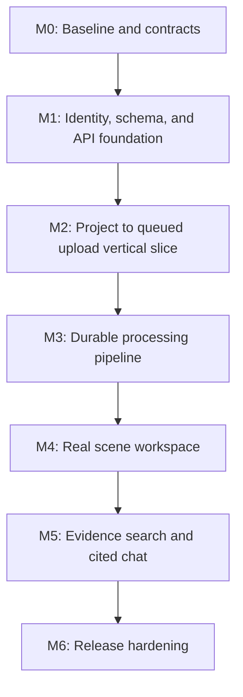

# Raikou V1 - Top-Down Implementation Plan

This plan implements the architecture in [V1 Top-Down Architecture](./v1-top-down-architecture.md) through small, testable vertical slices. It preserves the useful existing SAR pipeline while replacing prototype-only session storage, global search, and in-process background work.

## 1. Delivery strategy

Build the product in this order:

1. Make identity, ownership, configuration, and data durable.
2. Deliver one complete path: create project -> upload a scene -> queue it -> show durable status.
3. Move the existing processing code behind a reliable worker.
4. Replace mock workspace data with real scene evidence.
5. Add authorization-scoped search and cited chat.
6. Harden, observe, and release the complete path.

This is intentionally **not** a big-bang rewrite. Keep the current ingestion, patch pipeline, scene-record builder, SARCLIP encoder, Qdrant adapter, and vLLM integration where they are useful. Put new storage, job, and authorization boundaries around them first; retire legacy session endpoints only after the new path is proven.

## 2. Rules that keep delivery efficient

- **Contract first:** define Pydantic response models and OpenAPI examples before wiring a new React screen. The client works against stable project, scene, job, search, and chat contracts.
- **Vertical slices over layer silos:** each milestone produces a demonstrable user outcome, not only database or UI work.
- **One source of truth:** PostgreSQL owns scene/job state and the transactional outbox; S3 owns files; Qdrant is the semantic-search index; Redis carries ephemeral cache/query coordination and job-dispatch stream messages.
- **Authenticated by default:** every product endpoint resolves the current Supabase user and verifies project/scene ownership before touching storage or Qdrant.
- **No duplicate product paths:** migrate the existing `session_id` flow into resource IDs (`project_id`, `scene_id`, `job_id`) and consolidate chat into the project workspace.
- **Reuse, then refactor:** extract current processing functions into worker-safe services rather than reimplementing SAR preprocessing or model inference.
- **Keep V1 small:** no live feeds, optical workflows, change detection, teams, public API, billing, or unintegrated detector claims.

## 3. Required V1 feature coverage

| Required feature | Delivered in | Completion condition |
| --- | --- | --- |
| Accounts and private projects | M1-M2 | A user can only list, create, and open their own projects. |
| Supported SAR intake | M2 | Sentinel-1 GRD ZIP or one/two GeoTIFF files plus optional JSON metadata validate before processing. |
| Upload progress and durable jobs | M2-M3 | Upload progress is visible; queued/processing/ready/failed/cancelled state survives API restart. |
| SAR overview, metadata, patches, embeddings | M3 | Processing writes durable artifacts, metadata, patch records, and 768-d Qdrant vectors. |
| Scene evidence record | M3-M4 | The workspace shows provenance-aware metadata, land/water context, and only validated detector sidecar evidence. |
| Scene workspace | M4 | Overview, scene details, job history, artifacts, evidence, and Ask are real data rather than placeholders. |
| Semantic evidence search | M5 | Search is scoped to the caller's project and optional scene, and every result opens its source patch. |
| Evidence-grounded chat | M5 | Streamed answers include citations to supplied overview/patch/evidence IDs and state uncertainty when needed. |
| Safe public V1 operation | M6 | Security, tests, metrics/logs, backups, deployment, and a release checklist pass. |

## 4. Milestones and acceptance gates

### M0 - Baseline and contracts

**Goal:** protect the working prototype, eliminate dangerous configuration ambiguity, and agree on the interfaces the rest of the build uses.

**Work**

- Capture a local smoke-test baseline for the current happy path: supported SAR input -> process -> retrieve -> chat.
- Freeze the V1 scope and public language from the architecture document. Remove unsupported capability wording from the implementation backlog.
- Record the permitted model versions, attribution text, model source, and deployment location in a small internal model registry document.
- Define environment variables for Supabase, S3, Redis, Qdrant, model runtime, allowed CORS origins, upload limits, and job timeouts. Remove hard-coded model endpoints and configuration mismatches.
- Move any Supabase service-role value to backend-only secret storage and rotate it if it was ever exposed to a browser build.
- Add a concise API contract document or OpenAPI examples for `Project`, `Scene`, `Job`, `EvidenceResult`, `Citation`, and streamed chat events.
- Choose a canonical sample scene and expected evidence outputs for repeatable end-to-end testing.

**Gate to move on**

- The current prototype has a recorded smoke-test result.
- No browser bundle or checked-in example contains a privileged credential.
- Everyone builds against the same resource IDs and API shapes, not temporary session directories.

### M1 - Identity, data model, and API foundation

**Goal:** make user ownership and domain data real before any new user-facing feature depends on them.

**Backend and data work**

- Add versioned Supabase/PostgreSQL migrations for `profiles`, `projects`, `scenes`, `scene_artifacts`, `processing_jobs`, `patches`, `scene_evidence_records`, `conversations`, and `messages`.
- Add foreign keys, ownership columns, timestamps, lifecycle enums, indexes, and row-level security policies. A `scene` belongs to one project and one owner.
- Implement a reusable FastAPI `CurrentUser` dependency that verifies the Supabase bearer token once per request.
- Add authorization helpers that resolve `project_id`/`scene_id` ownership before every read or mutation.
- Replace the placeholder project endpoint with typed project and scene CRUD routes.
- Centralize settings in `app/core/config.py`; add startup validation and `/healthz` plus `/readyz` endpoints.
- Add the backend-only Redis configuration/client now (`REDIS_URL`, cache namespace/version, and timeouts). Make readiness verify Redis connectivity without treating an empty cache as a failure; the React client must never connect to Redis.
- Define one cache-key boundary before caching any feature: FastAPI creates versioned keys only from validated `owner_id`, `project_id`, optional `scene_id`, normalized-filter/query digests, and model/index versions. Do not accept caller-provided cache keys or put raw bearer tokens/query text in a key.
- Define the Qdrant payload contract now: each point has `owner_id`, `project_id`, `scene_id`, patch bounds, source artifact reference, and model/version metadata.

**Frontend work**

- Migrate the React application once from Create React App to Vite, then add React Router and a `QueryClient`.
- Add protected routes and a single authenticated API client that attaches the current Supabase access token to every FastAPI call.
- Keep Supabase direct access limited to authentication; route product data through FastAPI.

**Gate to move on**

- User A cannot read or mutate User B's project/scene through REST, database, or Qdrant payload filters.
- Redis is reachable only from backend services, `/readyz` reports its availability, and the shared cache-key helper cannot create an unscoped key.
- The dashboard can create and list real projects without using a conversation as a project surrogate.
- The new frontend shell builds and authenticates successfully.

### M2 - Project-to-queued-upload vertical slice

**Goal:** let an authenticated user create a project, add a scene, upload supported input efficiently, and see a durable job enter the queue.

**Backend and storage work**

- Introduce an object-storage interface with S3 implementation for production and local/MinIO implementation for development.
- Add `uploads/initiate`, `uploads/{plan_id}/parts/sign`, and `uploads/{plan_id}/complete` endpoints. `initiate` validates ownership, allowed file shapes, content limits, and creates a short-lived multipart upload plan; the part-sign endpoint binds each direct upload URL to its verified chunk checksum.
- Keep the browser data path direct to object storage. FastAPI only issues/revokes plans and records artifact metadata.
- On completion, verify object size/checksum, create the source artifact row and a `queued` processing job in one transaction, persist an outbox dispatch, then publish a job message.
- Enforce archive limits, file count limits, safe filename/path handling, MIME expectations, and a server-side checksum.

**Frontend work**

- Build the Projects dashboard and a New Project / Add Scene flow.
- Replace the browser-to-FastAPI multipart upload with signed multipart upload, byte-level progress, cancellation, and clear validation messages.
- Add a job status card that uses TanStack Query polling with sensible backoff and stops automatically at a terminal state.

**Gate to move on**

- A user can upload a supported scene from a fresh account, reload the page, and still see its queued job and source artifact.
- Unsupported files fail before any processing is started.
- The upload request never exposes AWS credentials in the browser.

### M3 - Durable SAR processing pipeline

**Goal:** turn an uploaded scene into durable scene artifacts, evidence, and private searchable vectors without tying the work to the FastAPI process.

**Worker and runtime work**

- Add Redis Stream consumer groups and an always-on PostgreSQL outbox dispatcher to local Docker Compose and hosted deployment. Run separate CPU/IO and GPU worker consumers; permit at most the measured safe inference concurrency per GPU. Reclaim stale publication leases, make processing idempotent by job ID, and keep stream keys separate from cache keys.
- Extract the current ingestion, VRT/overview, patch pipeline, scene-record builder, SARCLIP encoder, Qdrant upsert, and SARChat caption logic into idempotent worker stages.
- Use a job state transition contract: `queued -> validating -> processing -> ready`, with `failed` and `cancelled` terminal states. Persist a stage, progress, retry count, and safe user-facing error code after every stage.
- Store original files, VRT/derived intermediates where necessary, overview images, patch previews, sidecar evidence, and scene record in object storage. Store metadata and object keys in PostgreSQL.
- Upsert 768-d SARCLIP vectors with mandatory ownership/project/scene payload fields. On retry, make Qdrant updates idempotent; on scene deletion, delete records, artifacts, and vectors through a single cleanup workflow.
- Keep detector input optional. Validate an approved sidecar schema, preserve detector/model provenance, and never derive verified objects from SARChat text.
- Keep model inference behind configuration (`VLLM_BASE_URL`, model ID, timeouts, limits) and bound image/count/token inputs.

**Gate to move on**

- Restarting FastAPI during processing does not lose the job; a worker can resume/retry safely.
- A completed scene has an overview, metadata, evidence record, durable artifact references, patch metadata, and Qdrant vectors.
- A user can cancel a queued/processing job and no stale private vectors or artifacts remain after cleanup.

### M4 - Real project and scene workspace

**Goal:** replace the mock-backed pages with a single, coherent workspace that exposes the real scene lifecycle and evidence.

**Frontend work**

- Use one protected route: `/projects/:projectId`, with panels or tabs for **Overview**, **Scenes**, **Evidence Search**, and **Ask**.
- Replace static counts, files, detections, sources, and local-storage fallbacks with project/scene/job API queries.
- Show scene metadata, acquisition details, processing state, overview preview, artifacts, evidence-record status, and retry/cancel actions.
- Render signed preview URLs only when needed; never retain permanent public object URLs in the client.
- Implement source/evidence cards with patch ID, spatial location/bounds, retrieval score where relevant, provenance, and a deep link to the displayed patch.
- Consolidate the separate legacy `/chat` experience into the workspace; retire it only after the replacement has equivalent message-history behavior.

**Backend work**

- Add read endpoints for project summaries, scene detail, job status/history, signed artifact preview, patch details, and evidence records.
- Ensure every endpoint passes ownership checks before generating a signed URL or returning a scene record.

**Gate to move on**

- A fresh user can see their exact scene state after navigation or reload, without any mock data.
- An evidence card opens the actual authorized overview or patch that produced it.
- The user can understand whether an item is model observation, metadata, land/water estimate, or validated detector evidence.

### M5 - Scoped evidence search and grounded chat

**Goal:** make the final analyst experience useful while keeping all retrieval and generation evidence-bound.

**Backend work**

- Implement `POST /search` with a required project scope and optional scene scope. Apply ownership filtering before Qdrant search and include it in the Qdrant filter.
- Resolve Qdrant point IDs back to database patch/artifact records; return only valid, authorized evidence cards.
- Add the Redis cache only behind the M1 cache-key helper and only after ownership validation. Cache tenant-scoped query embeddings (60-minute TTL), Qdrant retrieval IDs/scores (5-minute TTL), and bounded authorized RAG context (2-minute TTL); PostgreSQL/S3 remain authoritative and Qdrant still performs every cache-miss semantic search.
- Key every cached value with the validated owner/project/optional-scene scope, normalized filters and query digests, plus model/index versions. Never cache uploads, artifacts, database records, signed URLs, bearer tokens, raw query text, chat streams, or unscoped/cross-tenant results.
- Invalidate affected project/scene retrieval and RAG-context keys whenever a scene is processed, retried, cancelled, deleted, reprocessed, or its metadata/evidence/artifacts change. Model/index-version keying naturally bypasses incompatible cached embeddings and results.
- Create conversations scoped to project and optional scene. Verify the caller owns the conversation and selected scene on every chat request.
- Define a citation payload for every streamed answer: source type, source ID, scene ID, patch/overview location, and why it was provided to the model.
- Build a bounded RAG prompt that gives SARChat only authorized metadata, selected overview(s), retrieved patches, and verified evidence-record facts. Ask it to distinguish evidence from uncertainty and prohibit it from representing generative bounding boxes as detections.
- Continue using NDJSON if it is already stable, or adopt SSE only if there is a concrete client/reconnect benefit. Do not support two stream protocols in V1.

**Frontend work**

- Add scene/project selector and optional metadata filters to Evidence Search.
- Stream chat inside the workspace, render status/error states, persist history through the API, and display citations as clickable source cards.
- Make empty/weak retrieval explicit: show that the answer has insufficient evidence rather than fabricating a confident result.

**Gate to move on**

- Cross-project and cross-user retrieval is impossible in both normal UI use and direct API tests.
- A scene reprocess, evidence update, or deletion invalidates its cached retrieval/context values before the next authorized search; cache expiry cannot expose stale or cross-tenant evidence.
- Each chat answer links to its provided evidence, and non-evidence visual-language output is labeled as an observation.
- A user can reload the workspace and recover their authorized conversation history.

### M6 - Release hardening and operations

**Goal:** make the complete V1 path safe to share with real users.

**Work**

- Lock production CORS to the actual React origin, enforce request/upload size limits, rate limits, timeouts, and security headers.
- Add structured logs with request ID, user/project/scene/job IDs; add error tracking and metrics for queue depth, Redis cache hit/miss/error rate, job duration/failures, GPU model errors, Qdrant latency, upload failures, and chat stream termination.
- Add health/readiness probes for API, Redis, Qdrant, object storage access, and model runtime. Do not include a model inference test on every readiness call.
- Package API, workers, Redis, Qdrant, and vLLM with Docker Compose on the GPU host; put Caddy/Nginx in front for TLS. Use managed Supabase and S3, with backups and lifecycle policies.
- Write a release runbook: environment setup, migration order, model startup, queue worker startup, rollback, scene deletion, incident response, and credential rotation.
- Add automated tests: migration/RLS tests, FastAPI authorization tests, storage upload tests, worker-stage unit tests, Qdrant filter tests, frontend component tests, and one end-to-end sample-scene flow.
- Run a final content pass so the landing and upload pages mention only supported inputs and measured capabilities.

**Release gate**

- A production-like environment can be deployed from documented configuration.
- The canonical sample scene completes end-to-end, gives scoped search results, and produces cited chat.
- Security, deletion, failure/retry, and cross-user isolation tests pass.
- Monitoring would reveal failed jobs, unavailable dependencies, and abandoned streams before users need to report them.

## 5. Parallel work without blocking the critical path

After M1 freezes the API shapes, the following can proceed in parallel:

| Workstream | Can run in parallel | Must wait for |
| --- | --- | --- |
| React shell, routing, auth guard, API client | M1 backend route contracts | M1 identity/API models |
| Database migrations and authorization | Frontend shell and visual cleanup | M0 contract decisions |
| Signed-upload UI | Object-storage adapter and upload endpoints | M2 upload contract |
| Worker extraction and Docker runtime | Workspace layout/components | M2 durable scene/job IDs |
| Scene workspace | Worker completion API/read models | M3 artifact/evidence data contract |
| Search/chat UI | Backend retrieval/citation contract | M5 search/chat schemas |

Avoid starting the detailed workspace UI or chat redesign before M3/M5 response shapes are frozen; that is where rework is most likely.

## 6. Key interfaces to freeze early

The API should publish these stable response models in M1/M2 so frontend and backend can work independently:

| Model | Must include |
| --- | --- |
| `ProjectSummary` | `id`, `name`, `scene_count`, `created_at`, `updated_at` |
| `SceneDetail` | IDs, lifecycle status, accepted metadata, source/overview artifacts, timestamps, `active_job_id` |
| `ProcessingJob` | `id`, `scene_id`, `status`, `stage`, `progress`, `retryable`, safe error information, timestamps |
| `UploadPlan` | upload ID, object key, multipart part instructions, expiry, maximum size; never credentials |
| `EvidenceResult` | scene/patch IDs, score, spatial context, signed preview URL or preview endpoint, provenance |
| `SceneEvidenceRecord` | evidence type, inputs, model/detector provenance, confidence/limitations, generated timestamp |
| `ChatEvent` | `conversation_id`, text delta/final status, citation list, safe error event |

## 7. V1 definition of done

V1 is ready only when an authenticated user can:

1. Create a private project.
2. Upload a supported SAR scene with progress and validation feedback.
3. Leave and return while durable processing continues.
4. Open a real workspace with its overview, metadata, processing state, evidence record, and artifacts.
5. Search only their project/scene and inspect the actual retrieved patches.
6. Ask a question and inspect cited sources in the streamed response.
7. Delete/cancel a scene safely, with its storage artifacts and vectors cleaned up.

And the team can prove that unauthorized users cannot see any of those resources.

## 8. What remains intentionally deferred

Do not pull these into the implementation plan without a new product decision: live imagery/tasking, optical inputs, SAR generation, change detection, built-in object detector integration, collaboration/team permissions, payments, public APIs, or performance claims that have not been benchmarked.
