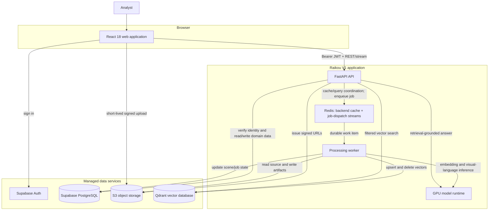

# Raikou V1 — Top-Down Architecture

**Purpose:** an authenticated analyst can upload a supported SAR scene, wait for it to be processed, search its visual evidence, and ask evidence-grounded questions about it.

This is deliberately a **V1 architecture**: one product workflow, durable data, clear ownership, and no unsupported claims.

## 1. Product boundary

### In V1

- Personal accounts and projects.
- Upload of a Sentinel-1 GRD ZIP, or one/two GeoTIFF files, with optional JSON metadata.
- Validation, metadata extraction, overview generation, patch indexing, and visible job progress.
- Text-to-SAR-patch retrieval within a project or selected scene.
- Scene workspace with metadata, overview, evidence record, source patches, and chat.
- Evidence-grounded SAR chat that cites the scene overview, retrieved patches, metadata, and any verified detector evidence.
- Optional import of an approved detector result sidecar. It is shown as detector evidence with provenance; it is not inferred from chat text.

### Explicitly outside V1

- Live satellite tasking, live video/frames, or continuous feeds.
- Optical-image input, optical-to-SAR generation, change detection, and time-series monitoring.
- Built-in object detection claims until a detector service and evaluation are actually integrated.
- Teams, organization roles, billing, a public developer API, or automated external actions.

### Trust rule

Generative model output is an observation, not a verified detection. Every answer must expose its sources and state uncertainty when the available scene evidence is insufficient.

## 2. System at a glance



The browser never receives storage credentials, a Supabase service-role key, or model credentials. It receives a Supabase access token and short-lived, narrowly scoped upload/download URLs.

## 3. Top-down responsibilities

| Layer | Responsibility | V1 decision |
| --- | --- | --- |
| React client | Authentication, project workspace, upload UX, job progress, search results, chat citations | React owns presentation and transient UI state only. It uses a single authenticated API client rather than querying product tables directly. |
| FastAPI | API contract, authorization, presigned uploads, search orchestration, streamed chat, signed artifact access, and cache control | FastAPI is the control plane and the only request-path service that reads or writes Redis cache entries. It must not run long SAR processing work in `BackgroundTasks` in production. |
| Redis | Backend-only cache/query coordination and job-dispatch streams | Redis is disposable derived state, never a product database. It caches only scope-bound query embeddings, retrieval IDs/scores, and bounded RAG context; it never stores files, signed URLs, bearer tokens, or ownership records. |
| Worker queue | PostgreSQL transactional outbox plus Redis Streams | The outbox is authoritative and a worker consumes a minimal job ID from a Redis Stream. Use separate CPU/IO and GPU consumer groups; limit GPU concurrency to the available GPU capacity. Keep stream keys/namespaces separate from cache keys. |
| Processing worker | Validation, raster preparation, previews, patch extraction, embeddings, scene record, status updates | Jobs are idempotent by scene and stage, so retries are safe. |
| Model runtime | SARCLIP retrieval embeddings and SARChat visual-language answers | SARCLIP uses 768-dimensional normalized embeddings. SARChat is served behind a local/private vLLM OpenAI-compatible endpoint. Keep model IDs and URLs in configuration, not source code. |
| PostgreSQL | Source of truth for users, projects, scenes, job state, artifact metadata, conversations, and messages | Supabase Postgres + Auth. FastAPI performs ownership checks for every domain request; RLS remains defense in depth. |
| Object storage | Original inputs and generated artifacts | AWS S3 for hosted V1; a local/MinIO adapter is acceptable for development only. |
| Qdrant | Semantic retrieval over scene patches | One `sar_patches` collection, cosine distance, and payload filters that always include `owner_id`, `project_id`, and `scene_id`. |

## 4. Selected technology stack

| Area | Selected V1 stack | Why it belongs in V1 |
| --- | --- | --- |
| Frontend | React 18, Vite, React Router, TanStack Query, Tailwind CSS, Lucide, `@supabase/supabase-js` | A small, conventional React stack for protected routes, server-state caching/polling, and the existing visual system. The current Create React App client should be migrated once rather than extended with hand-rolled routing. |
| API | Python 3.11, FastAPI, Pydantic v2, Uvicorn | Typed API contracts, OpenAPI documentation, streaming responses, and straightforward integration with the existing Python processing code. |
| Async work and cache | PostgreSQL transactional outbox + Redis Streams | PostgreSQL preserves each job intent before the API emits its minimal ID to Redis Streams, while FastAPI uses a separately prefixed Redis cache namespace for tenant-scoped derived query data. It is not a relational store or a vector-search replacement. |
| SAR processing | Rasterio/GDAL, NumPy, Pillow | Reads SAR rasters, builds previews/VRTs, extracts patches, and produces safely displayable images. |
| ML inference | SARCLIP ViT-L/14 for retrieval; SARChat through vLLM for visual-language inference | Matches the current retrieval and chat design. Model use must retain the authors' permission/attribution record. |
| Relational data and auth | Supabase Auth + PostgreSQL; `supabase-py` only in the backend | Manages identity and relational product data without a separately operated auth system. |
| File/object storage | AWS S3 + Boto3 | Supports large direct-to-storage uploads and durable artifacts; existing AWS configuration can be used after it is cleaned up. |
| Vector search | Qdrant + `qdrant-client` | Stores 768-d patch vectors plus the filters needed for tenant-safe retrieval. |
| Deployment | Docker Compose on one GPU-capable VM, with Caddy or Nginx for TLS/reverse proxy | A deployable V1 footprint: API, worker, Redis, Qdrant, and vLLM can be independently restarted and observed without a cluster. |

No Redux is needed for V1. Use TanStack Query for browser server data and local React state for the active scene, upload form, and chat composer. Redis is a separate backend-only cache; the browser never connects to it.

## 5. Core domain model

```text
auth.users
  └── profiles
        └── projects
              ├── scenes
              │     ├── scene_artifacts
              │     ├── processing_jobs
              │     ├── scene_evidence_records
              │     └── patches (metadata + Qdrant point ID)
              └── conversations
                    └── messages
```

| Entity | Important fields |
| --- | --- |
| `projects` | `id`, `owner_id`, `name`, `created_at` |
| `scenes` | `id`, `project_id`, `owner_id`, `status`, `sensor`, `acquisition_time`, `polarizations`, `source_artifact_id` |
| `scene_artifacts` | `id`, `scene_id`, `kind`, `storage_key`, `content_type`, `checksum`, `size_bytes` |
| `processing_jobs` | `id`, `scene_id`, `stage`, `status`, `progress`, `attempt`, `error_code`, `error_detail` |
| `patches` | `id`, `scene_id`, `qdrant_point_id`, spatial bounds, preview artifact reference, quality metadata |
| `scene_evidence_records` | `scene_id`, JSON evidence record, model/detector provenance, generated timestamp |
| `conversations` / `messages` | `project_id`, `scene_id` when scoped, user ownership, role, content, cited evidence IDs, status |

PostgreSQL owns ownership and lifecycle, and S3 owns uploaded and generated files. Qdrant is the semantic-search index, never the only copy of a scene's identity or access-control state. Redis is an expiring cache and task broker, never a source of truth.

## 6. Primary V1 flow

1. **Create project and scene.** The user creates a project, names the scene, and receives a `scene_id` owned by their account.
2. **Start upload.** FastAPI validates the requested file types and returns a short-lived S3 multipart upload plan. The React client shows byte-level progress.
3. **Complete upload.** The client calls the completion endpoint. FastAPI verifies the object exists, creates a `processing_job`, and queues it.
4. **Process scene.** The worker validates the archive/raster, rejects unsafe ZIP content, extracts metadata, creates a VRT and overview(s), tiles/preprocesses patches, writes SARCLIP embeddings to Qdrant, and creates a conservative scene evidence record.
5. **Publish ready state.** The worker persists artifacts and job state throughout. The UI polls `GET /jobs/{id}` until `ready`, `failed`, or `cancelled`.
6. **Search evidence.** FastAPI validates the scope, then checks its backend-only Redis cache. On a miss it embeds the user query, queries Qdrant with mandatory `owner_id` + `project_id` + optional `scene_id` filters, caches only the authorized derived retrieval IDs/scores, resolves patch metadata, and returns evidence cards with signed preview URLs.
7. **Ask about the scene.** FastAPI retrieves only authorized evidence, optionally reuses a short-lived bounded RAG context cache, sends the context to SARChat, streams the answer, then stores the answer and its citations in PostgreSQL. The UI lets the user open each cited patch or overview.

Redis cache entries are generated only after ownership validation. Cache keys contain a versioned namespace plus validated `owner_id`, `project_id`, optional `scene_id`, normalized-filter digest, query digest, and relevant model/index versions; they never use raw bearer tokens or caller-supplied key fragments. Use short TTLs (for example, 60 minutes for a query embedding, 5 minutes for retrieval IDs/scores, and 2 minutes for bounded RAG context) and invalidate affected project/scene entries when processing, evidence, metadata, model/index version, or lifecycle state changes.

Suggested scene state machine:

```text
draft → uploading → queued → validating → processing → ready
                                      └──────────────→ failed
queued / validating / processing → cancelled
```

## 7. API surface

Use resource names rather than ephemeral session IDs as the public API contract.

| Area | Example endpoints |
| --- | --- |
| Projects | `GET/POST /api/v1/projects`, `GET/PATCH/DELETE /api/v1/projects/{project_id}` |
| Scenes | `GET/POST /api/v1/projects/{project_id}/scenes`, `GET /api/v1/scenes/{scene_id}` |
| Uploads | `POST /api/v1/uploads/initiate` (idempotency key), `GET /api/v1/uploads/initiation/{client_request_id}`, `GET /api/v1/uploads/{plan_id}/status`, `POST /api/v1/uploads/{plan_id}/parts/sign`, `POST /api/v1/uploads/{plan_id}/complete`, `DELETE /api/v1/uploads/{plan_id}` |
| Jobs | `GET /api/v1/jobs/{job_id}`, `GET /api/v1/jobs/scenes/{scene_id}` |
| Evidence | `GET /api/v1/scenes/{scene_id}/evidence`, `POST /api/v1/search` |
| Chat | `POST /api/v1/conversations`, `POST /api/v1/conversations/{conversation_id}/messages` (NDJSON or SSE stream) |

Every non-health endpoint requires a Supabase bearer token. Each handler resolves the current user, verifies ownership through the project/scene relationship, and applies the same verified scope to database, storage, Qdrant calls, and Redis cache keys.

## 8. V1 feature set

| Feature | User outcome | Guardrail |
| --- | --- | --- |
| Accounts and projects | A user can sign in and organize private scene investigations | V1 is single-owner projects; no team sharing yet. |
| SAR upload | A user can upload supported GRD ZIP or GeoTIFF inputs and see validation errors early | File limits, content-type checks, ZIP traversal/bomb protection, and checksum recording are mandatory. |
| Durable processing | A user can see queued/processing/ready/failed status and retry a failed job | A worker owns processing; a web-server restart cannot silently lose the job. |
| Scene workspace | A user can view the overview, metadata, processing history, and source artifacts for a scene | Replace mock scene cards and session-local files with real IDs and artifact references. |
| Evidence search | A user can search a selected scene or project and open the retrieved patch evidence | Retrieval is always access-filtered and returns scores plus spatial/provenance context. |
| Evidence-grounded chat | A user can ask questions and inspect the patches/overviews used to answer | Never present VLM wording or boxes as verified detector output. |
| Evidence record | A user can inspect land/water context and any validated detector sidecar results | Imported detector output carries model/version/source provenance. |
| Operational safety | A user gets predictable errors and private data boundaries | Strict CORS, rate limits, structured logs, health/readiness checks, and delete cleanup are part of V1. |

## 9. Implementation order

1. **Foundation:** database schema/migrations, Supabase JWT dependency, project/scene APIs, Redis configuration/client/readiness and cache-key boundary, environment cleanup, and strict CORS.
2. **Durable intake:** S3 upload initiation/completion, artifact records, job records, React Router/TanStack Query client, and real project dashboard.
3. **Worker pipeline:** Redis Stream consumers plus an outbox dispatcher, object-storage artifact adapter, idempotent stages, Qdrant payload filters, and retry/cancel behavior.
4. **Workspace:** scene overview/metadata, actual evidence records, patch cards, and status UX.
5. **Search and chat:** project/scene-scoped retrieval, citation schema, bounded vLLM context, NDJSON/SSE streaming, and conversation persistence.
6. **Hardening:** upload tests, ownership tests, failed-job recovery tests, API/worker health checks, logging, backups, and deployment runbook.

## 10. Non-negotiable V1 safeguards

- Do not use local session directories as the source of truth for user data; they are a development cache only.
- Do not expose Supabase service credentials in the React build. Rotate any service credential that was ever placed there.
- Do not rely on a global Qdrant search. Every query and vector payload must carry tenant/project/scene scope.
- Do not let the browser connect to Redis or use Redis for product records, files, signed URLs, bearer tokens, or unscoped query results. Cache only short-lived, tenant-scoped derived embeddings, retrieval IDs/scores, and bounded RAG context.
- Do not use caller-provided cache keys. Scope and hash every cache key, set a TTL, and invalidate it whenever the underlying scene/project evidence changes.
- Do not let a caller supply an arbitrary `scene_id` or `conversation_id` without validating ownership.
- Do not use permissive production CORS or hard-code vLLM endpoints/model paths.
- Do not advertise live imagery, optical ingestion, 512-d embeddings, edge real-time latency, or detector capability until they exist and are measured.

This architecture keeps the existing core pipeline—SAR upload → SARCLIP indexing → Qdrant retrieval → SARChat—while making it suitable for real V1 users: durable, private, observable, and explicit about what the evidence supports.
